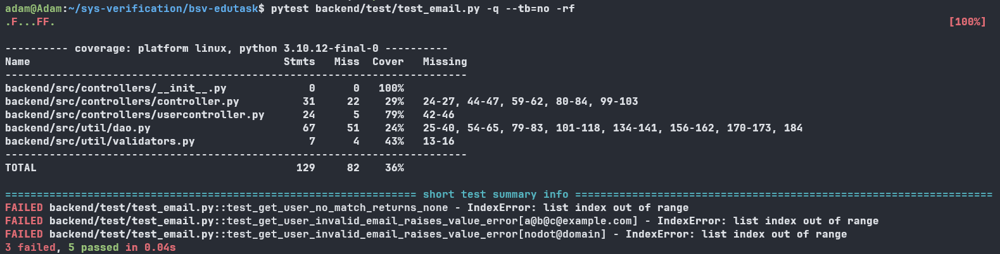

# Lab 1 – Assignment 2: Unit Testing  

**Group 30 – Daniel Mohagheghifard & Adam Abdullah**

---

## Work distribution  
Daniel and Adam **pair-programmed** the whole test implementation.

| Contribution | Author |
|--------------|--------|
| Brain-storm notes & first drafts (Sections 1, 2.1) | Daniel |
| Text refinement, formatting, repo link | Adam |
| Test-case design table | both (joint session) |

---

## 1  Mocking  

Mocking is the practice of creating *fake* objects or functions that simulate real components, so we can control inputs, outputs, and side-effects. A mock replaces a dependency (here: the database) with an object whose methods can be told to return specific values or raise exceptions.  

### 1.1  Why use mocking in unit tests?  
* Isolate the unit code from its dependencies.  
* **Edge-case simulation** – force the DAO to raise rare errors.  
* Better performance – skip slow operations (e.g. network) so the suite runs quickly.  
* No real DB or service needed; each test defines exactly what the mock must do.

---

## 2  EduTask unit testing

### 2.1 Intro and test cases  
We wrote unit tests in [`backend/test/test_email.py`](https://github.com/tr3sp4ss3rexe/bsv-edutask/blob/master/backend/test/test_email.py) for `get_user_by_email`.

Five scenarios cover the *original* requirements:

| ID | Scenario | Input | Mock behaviour | Expected output |
|----|----------|-------|----------------|-----------------|
| TC1 | **Valid** e-mail, one user | `alice@example.com` | DAO → `[user]` | that user |
| TC2 | Valid e-mail, **no** user | `ghost@example.com` | DAO → `[]` | `None` |
| TC3 | Valid e-mail, **>1** user | `dup@example.com` | DAO → 2 users | first user + warning |
| TC4 | **Invalid** e-mail | `not-an-email` | DAO not called | `ValueError` |
| TC5 | DB exception | `bob@example.com` | DAO raises `Exception("DB fail")` | same exception |

We combined **equivalence partitioning** with a bit of error-guessing to keep coverage high while avoiding redundancy.

---

### 2.1.1 Detailed four-step test-design tables  
*(feedback item: “ground truth contains more detailed information”)*

#### Action & conditions  
*Action:* `get_user_by_email(email)`  
*Expected outcomes:* user dict | `None` | `ValueError` | DB exception

| Condition | Values |
|-----------|--------|
| **C1 – “@” count** | 0, **1**, >1 |
| **C2 – “dot in domain”** | absent, **present** |
| **C3 – DAO result size** | 0, **1**, >1 |
| **C4 – DAO raises error** | **no**, yes |

*(Valid e-mail = exactly one “@” **and** at least one dot after it)*

#### Table A – all logically valid combinations  

| # | C1 | C2 | C3 | C4 |
|---|----|----|----|----|
| 1 | 1 | present | 1 | no |
| 2 | 1 | present | 0 | no |
| 3 | 1 | present | >1 | no |
| 4 | 1 | present | – | yes |
| 5 | 0 or >1 | – | – | no |

#### Table B – expected outcome  

| # | Outcome |
|---|---------|
| 1 | return first user |
| 2 | return `None` |
| 3 | warn + return first user |
| 4 | propagate exception |
| 5 | raise `ValueError` |

---

### 2.2 Implementation highlights  

* File: `backend/test/test_email.py` – **one `assert` per test**, per feedback.  
* Common DAO stub provided via a `pytest.fixture`.  
* Parameterised check for three invalid e-mail patterns.  

---

#### 2.2.a `pytest` execution  

The latest `pytest` run reports **three failures** and the traceback pinpoints the same fault in every case:
```
backend/test/test\_email.py .F...FF. \[100%]
...
IndexError: list index out of range  ← raised in usercontroller.py line 37

````
After reviewing both the test file and **`usercontroller.py`**, we confirmed that the *“no users”* path is to blame: when the mocked DAO returns an empty list, the code at **line 37** still tries to access `users[0]`, which raises an `IndexError`. The failing scenarios are:

* **TC2** – *valid e-mail, no user* (`ghost@example.com`)
* **TC4a** – *invalid e-mail* (`a@b@c@example.com`)
* **TC4b** – *invalid e-mail* (`nodot@domain`)

This reveals two latent defects:

1. **Missing `None` guard** – the component assumes at least one DB match and crashes on an empty list.  
2. **Over-permissive e-mail regex** – addresses that are supposed to be invalid slip through, reach the DAO, and then hit the same empty-list bug.




---

#### 2.2.b Coverage interpretation  
- **usercontroller.py (79 %)** – Our eight unit tests execute every functional
  branch except the small `else` block at lines 42-46 that would run only if
  `len(users)==0` and we printed the “more than one user” debug line.
- **controller.py (29 %)** – This file isn’t under test; its 22 missed lines are
  constructors and generic helpers that the `UserController` tests never call.
- **dao.py (24 %)** – Heavy database/integration logic is mocked away, so almost
  all of its 67 statements remain uncovered in this unit-level run.
- **validators.py (43 %)** – Only the trivial import path is touched; the real
  validation routines are deferred to a future assignment.
- **package total (36 %)** – The low overall percentage is expected because
  coverage was collected for the entire `backend` package even though the scope
  of this assignment is a single controller class.
