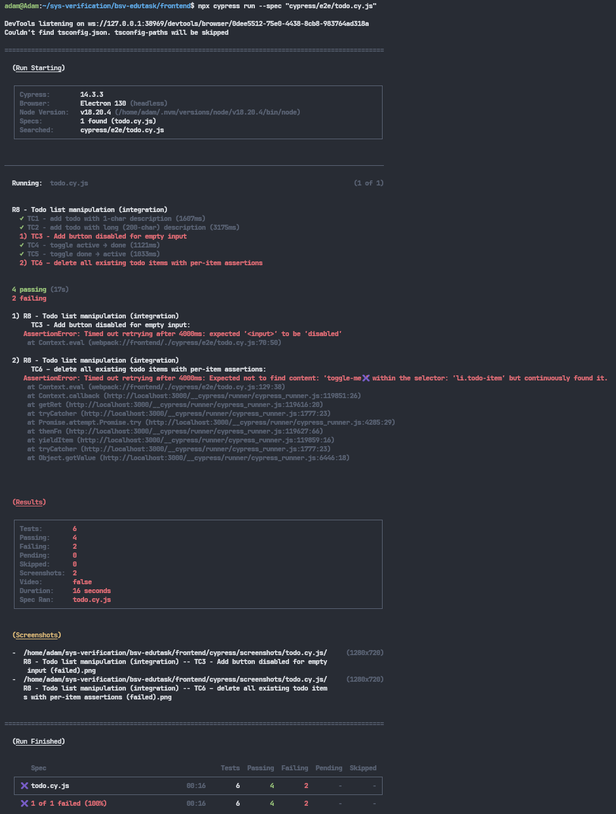

# Assignment 4 – GUI Testing

> *Authors / Work-distribution:* **Group 30 – Daniel Mohagheghifard & Adam Abdullah**
> *Details:* Both authors analysed the R8 requirements, implemented Cypress tests, debugged each
> other’s code, researched declarative vs imperative testing, and prepared the written material.
> Daniel drafted the discussion section; Adam converted the report to Markdown and organised the
> repository structure.

---

## 1 · Graphical-user-interface tests (Requirement 8)

### 1.1 Test-case list (derived with equivalence + boundary analysis)

* **TC-1 Add todo – minimum length (1 char)**
  *Pre*: popup open, input empty.
  *Steps*: type “A” → press **Add**.
  *Expected*: new, **active** `<li>` appended at bottom, shows “A”.

* **TC-2 Add todo – maximum accepted length (200 chars)**
  Same as TC-1 but description is 200דx”.
  *Expected*: long text rendered un-truncated.

* **TC-3 Add todo – empty description (alt 2.b)**
  Input is cleared.
  *Expected*: **Add button disabled** & no request is sent.
  *Status with current UI*: **fails** (button never disabled).

* **TC-4 Toggle active → done**
  Add “toggle-me”; click its checker once.
  *Expected*: todo gains CSS class `checked` (strikethrough).

* **TC-5 Toggle done → active**
  Same item, click checker again.
  *Expected*: CSS class becomes `unchecked` (no strike).

* **TC-6 Delete todo**
  Add “delete-me”; click ×.
  *Expected*: row disappears from DOM.

#### Table A – Test Cases Overview

| ID   | Scenario                     | Input/Precondition        | Action                   | Expected output                         | Status |
| ---- | ---------------------------- | ------------------------- | ------------------------ | --------------------------------------- | ------ |
| TC-1 | Add todo – minimum length    | popup open, input empty   | Type “A” → click Add     | New active `<li>` with “A”              | ✓ pass |
| TC-2 | Add todo – maximum length    | popup open, input empty   | Type 200דx” → click Add | New `<li>` with full 200‑char text      | ✓ pass |
| TC-3 | Add todo – empty description | popup open, input cleared | Click Add                | Add button disabled; no network request | ✗ fail |
| TC-4 | Toggle active → done         | existing active todo      | Click checker            | `<li>` has class `checked`              | ✓ pass |
| TC-5 | Toggle done → active         | existing done todo        | Click checker            | `<li>` has class `unchecked`            | ✓ pass |
| TC-6 | Delete todo                  | popup open, item present  | Click ×                  | `<li>` removed from DOM on **one click** | ✗ fails (requires 2 clicks) |

#### Table B – Requirements Traceability

| Requirement   | Test Case ID |
| ------------- | ------------ |
| R8UC1 Alt 2.b | TC-3         |
| R8UC3 Alt 4.a | TC-6         |

### 1.2 Cypress implementation

* **Test spec** `todo.cy.js` → [https://github.com/tr3sp4ss3rexe/bsv-edutask/blob/master/frontend/cypress/e2e/todo.cy.js](https://github.com/tr3sp4ss3rexe/bsv-edutask/blob/master/frontend/cypress/e2e/todo.cy.js)
* **API helpers** `commands.js` → [https://github.com/tr3sp4ss3rexe/bsv-edutask/blob/master/frontend/cypress/support/commands.js](https://github.com/tr3sp4ss3rexe/bsv-edutask/blob/master/frontend/cypress/support/commands.js)

### 1.3 Execution evidence

* Interactive run 
* CLI run 

**Detected system failure**

> *R8UC1 Alt 2.b*: “Add” button must remain disabled when the description is empty.
> In the current front-end (`TaskDetail.js`) the `<input type="submit">` is never given a `disabled` prop, therefore TC-3 fails and reveals a requirement violation.

> *R8UC3 Alt 4.a*: “Deleting a todo must remove it from the list on a single click.”  
> In the current front-end (`TaskDetail.js` → `deleteTodo`), the `fetch(..., method: 'delete')` and the calls to `updateTask()`/`updateTasks()` are not properly chained, so the UI refresh happens *before* the DELETE actually finishes. As a result, the first click does **not** remove the `<li>` (only a second click does), exposing a clear violation of the single-click deletion requirement.  

---

## 2 · Declarative vs Imperative UI testing

### 2.1 Explanation of both styles

1. **Imperative tests** express *how* to perform every interaction step-by-step — e.g.
   `cy.get('#login').click(); cy.get('[name=pw]').type('secret'); cy.contains('OK');`
   They mirror a human script and give full control over timing and selectors but are tightly coupled to UI detail.

2. **Declarative tests** state *what* outcome is expected, letting the framework figure out the steps — e.g.

   ```gherkin
   WHEN I log in with valid credentials
   THEN I see my dashboard
   ```

### 2.2 Which style suits UI best

* **Imperative is needed at the lowest layer:** browsers are driven with concrete selectors and events.
* **Declarative is preferable for business intent:** tests such as “create todo” are shorter, less brittle, and readable for non-developers.

Best practice → wrap low-level imperative commands in helpers (`cy.addTodo(desc)`, `cy.toggleTodo(label)`) and compose those helpers declaratively in feature-level scenarios.
